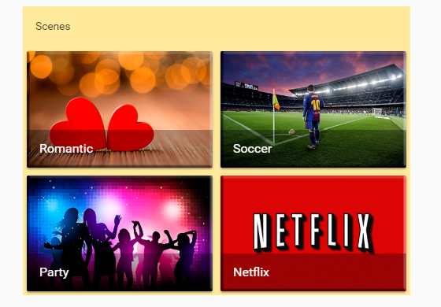

# Vertical Style Card
Vertical Style is a custom Lovelace card for Home Assistant who let you group diferent cards in one vertical-stack card, with diferent style options, like title, card color, to have a border or not. This is very useful for cards like custom:button-card or picture-entity, giving the option for add a title and grouping in a column.




## Options

| Name | Type | Default | Description
| ---- | ---- | ------- | -----------
| type | string | **Required** | `custom:vertical-style-card`
| cards | list | **Required** | List of cards
| title | string | **Optional** | Card title
| style | object | **Optional** | Options: font_size, border,background_color


## Style Object

| Name | Type | Default | Options
| ---- | ---- | ------- | -----------
| font_size | string | **Optional** | `Example: 20px`
| border | boolean | **true** | Show or not the card border
| background_color | string | **Optional** | Options: rgb, var(--), hex


## Installation

1. Install the `vertical-style-card` card by copying `vertical-style-card.js` to `<config directory>/www/vertical-style-card.js`

Bash:
```bash
wget https://raw.githubusercontent.com/matisaul/vertical-style-card/master/vertical-style-card.js
mv vertical-style-card.js /config/www/
```

2. Link `vertical-style-card` inside you `ui-lovelace.yaml` 

```yaml
resources:
  - url: /local/vertical-style-card.js?v=0.0.1
    type: js
```

3. Add a custom card in your `ui-lovelace.yaml`

**Example**

```yaml
- type: custom:vertical-style-card
  title: Scenes
  style:
    font_size: 18px
    border: false
    background_color: var(--secondary-background-color)
  cards:
    - type: horizontal-stack
      cards:
        - type: picture-entity
          image: /local/images/love.png
          entity: scene.romantic
          name: Romantic
          show_state: false
          tap_action: toggle
        - type: picture-entity
          image: /local/images/soccer.png
          entity: scene.soccer
          name: Soccer
          show_state: false
          tap_action: toggle 
    - type: horizontal-stack
      cards:
        - type: picture-entity
          image: /local/images/party.png
          entity: scene.party
          name: Party
          show_state: false
          tap_action: toggle
        - type: picture-entity
          image: /local/images/netflix.png
          entity: scene.netflix
          name: Netflix
          show_state: false
          tap_action: toggle

 
```

## Credits
- [ofekashery](https://github.com/ofekashery)
- [ciotlosm](https://github.com/ciotlosm)
- [thomasloven](https://github.com/thomasloven)
- 

